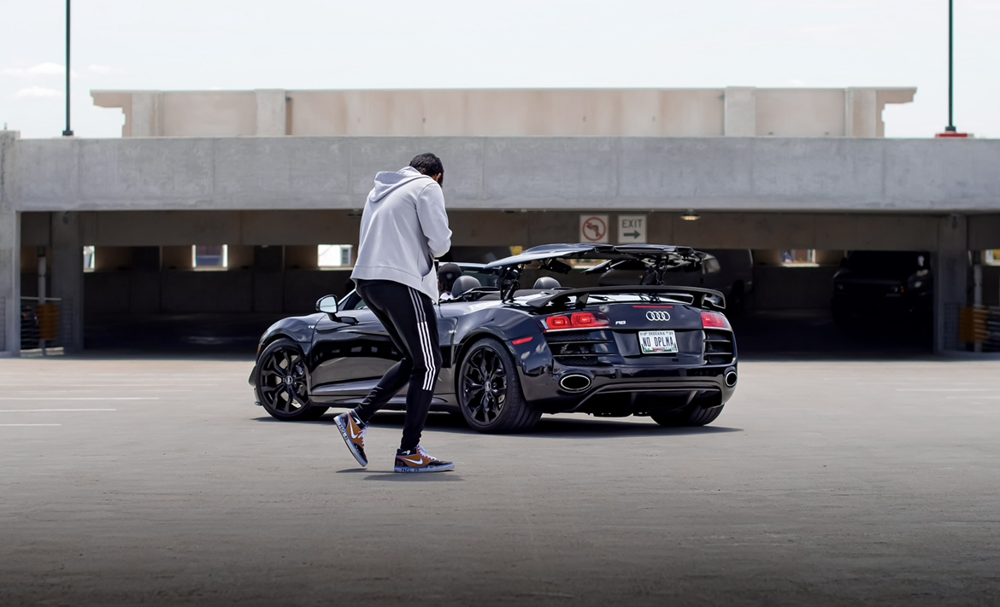
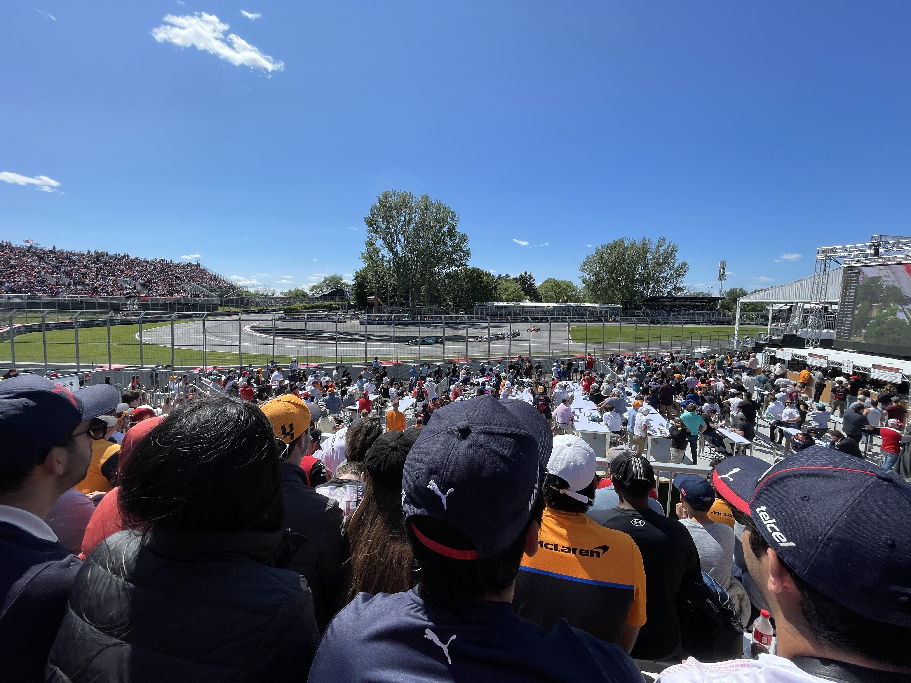

# **Aryan Desai**

___
Hi! I'm Aryan and I'm a second year student at the [University of California, San Diego](https://ucsd.edu), majoring in Computer Engineering!

## Table of Contents
---
* CSE Coursework
* Familiar Programming Languages
* Formula One

## CSE Coursework
____
I've thus far completed or am actively completing the following CSE courses here at UCSD:

- [x] CSE 11: Introduction to Programming and Computational Problem Solving
- [x] CSE 12: Basic Data Structures and Object-Oriented Design
- [x] CSE 15L: Software Tools and Techniques Laboratory
- [x] CSE 21: Mathematics for Algorithms and Systems
- [x] CSE 30: Computer Organization and Systems Programming
- [x] CSE 100: Advanced Data Structures
- [ ] CSE 101: Design and Analysis of Algorithms _(in progress)_
- [ ] CSE 110: Software Engineering _(in progress)_

## Familiar Programming Languages
___
```
- Java
- JavaScript
- HTML
- Python
- MATLAB
- C
- C++
- Assembly (ARM32)
```
>Here's an example of Java Code :)
```
System.out.print("Hello World!);
```
## Formula One
---
### Favorite F1 Drivers
---
1) Sebastian Vettel
2) Carlos Sainz
3) Ayrton Senna
4) Lewis Hamilton
5) Lando Norris
### Favorite F1 Livery
---
Check out [this](Carlos_Sainz_Jr_2017_Malaysia_FP2_2.jpg) picture of my favorite F1 livery from recent years!
### F1 Races I've Been At
---
You can see a picture from the first F1 race I ever went to in Canada in 2022 below!



---

I hope you enjoyed this page! Look forward to incremental updates in the future!


